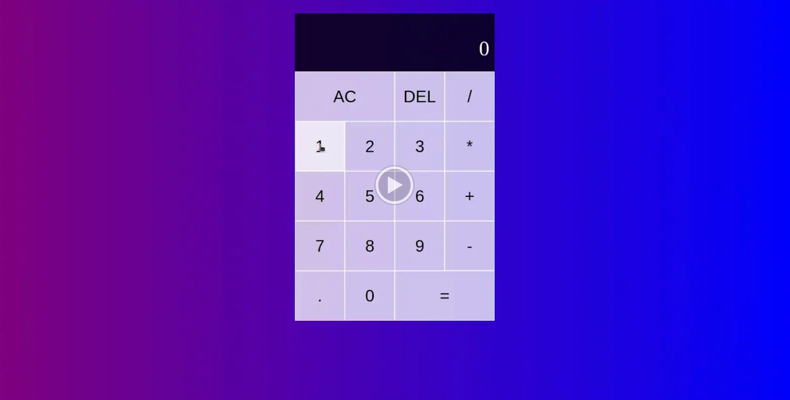

# React Calculator


## Description

This is a simple calculator built using React and Vite, featuring a component-based structure for easy maintenance and scalability. It is designed to perform basic arithmetic operations like addition, subtraction, multiplication, and division. The application allows users to input numbers and operators via an intuitive button interface. The project uses React's useState hook to manage input and result states, ensuring real-time updates with every button click. The eval() function is used (with basic error handling) to calculate the result of mathematical expressions.

The user interface includes a "Delete" (DEL) button for removing the last character and an "All Clear" (AC) button to reset the calculator. The application is responsive and works seamlessly across different screen sizes, making it accessible on both desktop and mobile devices.

## Table Of Contents

- [🎥 Video Walkthrough ](#🎥-video-walkthrough)
- [🚀Installation ](#🚀-installation)
- [🏗️ Usage](#🏗️-usage)
- [⚒️ Technologies Used](#⚒️-technologies-used)
- [🤝 Contributing ](#🤝-contributing)
- [📄 License ](#📄-license)
- [❓ Questions ](#❓-questions)

## 🎥 Video Walkthrough

The following video demonstrates the application functionality:

[](https://drive.google.com/file/d/1Pr1NNhKvb6wxtG5xknrwsyhO-ys2a3YX/view)

## 🚀 Installation

1. Clone the Repository:

```sh
git clone https://github.com/A-MOHAMED14/React-Calculator.git
```

2. Navigate to the Project Directory:

```sh
cd React-Calculator
```

3. Install dependencies:

```sh
npm install
```

## 🏗️ Usage

To start the application, run the following command:

```sh
npm run dev
```

### Notes

- Use npm run dev for development, which starts the app in development mode with Vite's fast refresh using HMR.
- Use npm run build to create a production build.

## ⚒️ Technologies Used

- React: For building the user interface with a component-based architecture.
- Vite: For fast development and optimized bundling.
- JavaScript (ES6+): The programming language used for app logic and interactivity.
- HTML & CSS: For structuring and styling the calculator layout.
- useState Hook: For managing input and result states in React.

## 🤝 Contributing

Contributions are welcome! If you'd like to contribute to this project, please follow these guidelines:

1. Fork the repository.
2. Create a new branch for your feature or bugfix:

```sh
git checkout -b feature/your-feature-name
```

3. Make your changes and commit them with descriptive messages:

```sh
git commit -m "Add new feature: your feature description"
```

4. Push your changes to your forked repository:

```sh
git push origin feature/your-feature-name
```

5. Open a pull request to the main repository, describing your changes in detail.

## 📄 License

This project is licensed under the MIT License. You are free to use, copy, modify, merge, publish, distribute, sublicense, and/or sell copies of the software, provided that the original copyright notice and permission notice are included in all copies or substantial portions of the software. For more details, see the MIT [LICENSE](https://opensource.org/licenses/MIT) file.

## ❓ Questions

If you have any questions about the project, please feel free to contact me directly:

GitHub: <a href="https://github.com/A-MOHAMED14">A-MOHAMED14</a>

Email: <a href="mailto:amin800@hotmail.co.uk">amin800@hotmail.co.uk</a>
